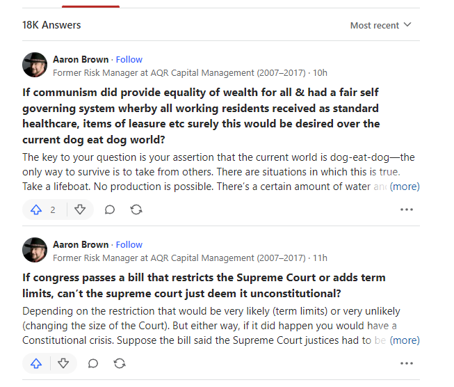

## WEB SCRAPING - DYNAMIC PAGES

Using the RSelenium wrapper to scrape pages that loads elements dynamically. I picked a case where we'll have to execute some js to scroll down to load more elements. I have another practical example of scraping a dynamic website for a trading project [here](https://github.com/NedHermann/trading_projects/tree/master/src/earnings_announcement_forecast). 

Most times, for dynamic websites I can just find the url request in the network tab & make my own requests to it - would bypass the need of any scrapers. 

### Loading Libraries 
- tidyverse: data science
- RSelenium: R wrapper for Selenium
- netstat: to apply a free port number to our driver (optional)

```
library(tidyverse)
library(RSelenium)
library(netstat)
```

### Setting up the driver & client object
- rs_driver_obj: Our selenium driver object that'll run on firefox.
- rs_client: The client object from our driver. We'll be accessing the website through it.

```
rs_driver_obj <- rsDriver(
  browser = "firefox",
  chromever = NULL,
  verbose = FALSE,
  port = netstat::free_port())

rs_client <- rs_driver_obj$client
```

### Website
I had a friend who had a man-crush on Aaron Brown. In the past, he had difficulty scraping Aaron's answers on Quora. So, I decided to use it for this demonstration.  
We'll be scraping Aaron Brown's answers on Quora [here](https://www.quora.com/profile/Aaron-Brown-165/answers).
- Use the `$navigate()` function to navigate to the website

```
rs_client$navigate("https://www.quora.com/profile/Aaron-Brown-165/answers")
```

### Website cont.
Below is how the website looks. We want the title, sub-heading, question, answer, and url to each individual article.  
As we can see, if the answers are long enough, the rest of it's contents will not be loaded until the `more` element at the end of each answer is clicked. We are going to need to build a robust solution where, if the `more` element exists, to click it, and then scrape the full answer.



### Defining variables for our while loop
We are going to use a `while loop` to scrape Aaron's answers. There isn't really any defined way to pull the x-th'd answer, we'll just need to constantly get the driver to scroll down, load the new posts, open the full answers, and then scrape it's contents.  
For this while loop, we'll need to define a few variables:
- tbl: an empty list object that'll contain our scraped posts
- ref_height: our reference (or last) height of the loop
  - We'll need to use the `$executeScript()` function and enter `return document.body.scrollHeight` to pull the current height of the page.
- new_height: our newest height of the loop
  - For the first iteration, we just need the new_height to be greater than the current ref_height to start the while loop.
- collected_posts: the number of posts we have successfully scraped

```
tbl <- list()
ref_height <- rs_client$executeScript("return document.body.scrollHeight")[[1]]
new_height <- ref_height + 1
collected_posts <- 0
```

### The while loop
A lot to unpack here, we'll take it step-by-step. The way the while loop is structured is that while the statement `new_height > ref_height` is *true*, then it'll run the function, then repeat. This is why we need the new_height variable to start out greater than ref_height.

```
while(new_height > ref_height){
  
  timestamp <- Sys.time()
  
  if(length(tbl) > 0){
    ref_height <- new_height
  } 
  
  posts <- rs_client$findElements("css selector", "div.q-box.qu-pt--medium.qu-borderBottom") %>%
    tail(., length(.)-collected_posts)
  
  scraped_posts <- lapply(1:length(posts), function(x){
    num <- posts[[x]]
    
    tryCatch({
      num$findChildElement("css selector", "div.qt_read_more")$clickElement() %>%
        suppressMessages()
      
      Sys.sleep(time = 1.5)
      
    }, error = function(e){
      message(sprintf("No read more for post: %s", collected_posts + x))
    })
    
    link_urls <- posts[[x]]$findChildElements("css selector", "a")
    
    tbl <- num$getElementText() %>%
      str_split_fixed(., "\n", 4) %>%
      data.frame() %>%
      select("author" = 1, "sub_heading" = 2, "question" = 3, "answer" = 4) %>%
      mutate(url = last(link_urls)$getElementAttribute("href")[[1]],
             timestamp = timestamp)
    
    return(tbl)
  })
  
  tbl[[length(tbl)+1]] <- bind_rows(scraped_posts)
  
  rs_client$executeScript("window.scrollTo(0, document.body.scrollHeight);")
  
  Sys.sleep(time = 1.5)
  
  new_height <- rs_client$executeScript("return document.body.scrollHeight")[[1]]
  collected_posts <- collected_posts + length(posts)
  
  if(collected_posts > 20){
    break
  }
}
```

### While loop cont.
- First, I created a variable called `timestamp` that'll record the start of each loop. The reason we have this here is because the way Quora displays the timestamp of each post is relative to the time that the data was requested. The format for those times are inconsistent (ie. 11h, Wed, etc). Therefore, if it's ever the case that you want the actual timestamp of the post, you can extract it from the timestamp.  
- Next, I have an `if else` statement where any iteration after the 1st will update our `ref_height` with our pre-loop `new_height`

```
timestamp <- Sys.time()

if(length(tbl) > 0){
  ref_height <- new_height
} 
```

### While loop cont.
- We use the `$findElements()` function to find all posts loaded on the page.
- We then create a new variable called `posts` that'll save all of the posts we *didn't* collect yet by subtracting our collected_posts number from our total posts.

```
posts <- rs_client$findElements("css selector", "div.q-box.qu-pt--medium.qu-borderBottom") %>%
  tail(., length(.)-collected_posts)
```

### While loop cont.
- We use the `lapply()` function to apply a function to each new post that we have pulled and saved them to a list called `scraped_posts`.
- Within the lapply, first we specify the exact post we want to scrape by indexing by the current iteration and saving that post as `num`.
- Then, we use the `$findChildElement()` and `$clickElement()` functions to find and click the `more` div that is suppressing the full content.
  - We need to wrap this part with a `tryCatch` because if the element doesn't exist, it'll throw us an error. Whenever this occurs, I send a message to the console that specifies that this had occured and at what post number (we index posts later) did it occur in.
- After attempting the click the `more` element, I then sleep our session by 1.5 seconds so the page can update.
- To collect the answer's url, I use the `$findChildElements()` function again to save all anchor tags in the list called `link_urls`.
- Finally, I use the `$getElementText()` function to pull all the text of the post, used the `str_split_fixed()` function to split the text by element, convert the vector of text into a dataframe, and then add the `url` and `timestamp` columns.
  - The last url of the link_urls list contains the article's url. So, we'll grab that with the `last()` function and use the `$getElementAttribute()` function to pull it's href.
- Once the tbl is made, we return save it to our `scraped_posts` list.

```
scraped_posts <- lapply(1:length(posts), function(x){
  num <- posts[[x]]

  tryCatch({
    num$findChildElement("css selector", "div.qt_read_more")$clickElement() %>%
      suppressMessages()

    Sys.sleep(time = 1.5)

  }, error = function(e){
    message(sprintf("No read more for post: %s", collected_posts + x))
  })

  link_urls <- posts[[x]]$findChildElements("css selector", "a")

  tbl <- num$getElementText() %>%
    str_split_fixed(., "\n", 4) %>%
    data.frame() %>%
    select("author" = 1, "sub_heading" = 2, "question" = 3, "answer" = 4) %>%
    mutate(url = last(link_urls)$getElementAttribute("href")[[1]],
           timestamp = timestamp)

  return(tbl)
})
```

### While loop cont.
- Recall we created a higher-level empty list called `tbl` a [few sections ago](#defining-variables-for-our-while-loop). Now, we'll be binding our scraped_posts list as a single dataframe and saving it to our main tbl.
- We then use the `$executeScript()` function and inputted the js: `window.scrollTo(0, document.body.scrollHeight);` to scroll down to the *next bottom* of the page.
- We then sleep the session for another 1.5 seconds for the page to update with the new data.
- After, we overwrite our previous `new_height` variable with the current height of the page.
- Finally, we update the amount of posts that we have collected to our `collected_posts` variable.

```
tbl[[length(tbl)+1]] <- bind_rows(scraped_posts)

rs_client$executeScript("window.scrollTo(0, document.body.scrollHeight);")

Sys.sleep(time = 1.5)

new_height <- rs_client$executeScript("return document.body.scrollHeight")[[1]]
collected_posts <- collected_posts + length(posts)
```

### While loop cont.
Since I didn't want to scrape all 16k+ answers from Aaron Brown, I set the limit of the scrape to just pull until we hit 20 posts with this line of code:

```
if(collected_posts > 20){
  break
}
```

### Sample of the first tbl's results
I shortened the first answer by interuptting it with ellipsis because it was incredibly long...  
If we look at the end of the `sub_heading` column, we can see that the final few characters displays the time that the answer was posted relative to the timestamp that requested it. In the next section, we'll be extract this into it's own column.

|author     |sub_heading                                                 |question                                                                                                                                                                                                                                  |answer                                                                                                                                                                                                                                                                                                                                                                                                                                                                                                                                                                                                                                                                                                                                                                                                                                                                                                                                                                                                                                                                                                                                                                                                                                                                                                                                                                                                                                                  |url                                                                                                                                                                                                                                       |timestamp           |
|-----------|------------------------------------------------------------|------------------------------------------------------------------------------------------------------------------------------------------------------------------------------------------------------------------------------------------|--------------------------------------------------------------------------------------------------------------------------------------------------------------------------------------------------------------------------------------------------------------------------------------------------------------------------------------------------------------------------------------------------------------------------------------------------------------------------------------------------------------------------------------------------------------------------------------------------------------------------------------------------------------------------------------------------------------------------------------------------------------------------------------------------------------------------------------------------------------------------------------------------------------------------------------------------------------------------------------------------------------------------------------------------------------------------------------------------------------------------------------------------------------------------------------------------------------------------------------------------------------------------------------------------------------------------------------------------------------------------------------------------------------------------------------------------------|------------------------------------------------------------------------------------------------------------------------------------------------------------------------------------------------------------------------------------------|--------------------|
|Aaron Brown|Former Risk Manager at AQR Capital Management (2007–2017)12h|If communism did provide equality of wealth for all & had a fair self governing system wherby all working residents received as standard healthcare, items of leasure etc surely this would be desired over the current dog eat dog world?|The key to your question is your assertion that the current world is dog-eat-dog—the only way to survive is to take from others...                                                                                                                                                                                                                                                                                                                                                                                                                                                                                                                                                                                                                                                                                                                                                                                                                                                                                                                                                                                                                                                                                                                                                                                                                                                                                                                      |https://www.quora.com/If-communism-did-provide-equality-of-wealth-for-all-had-a-fair-self-governing-system-wherby-all-working-residents-received-as-standard-healthcare-items-of-leasure-etc-surely-this-would-be-desired-over-the-current|2023-02-27T12:48:32Z|

### Cleaning the table
- We use the `bind_rows()` function to bind our tbl'd list to have all our posts in one dataframe
- We change the `answer` column to replace all `\n` (line-breaks) with a space.
- We then use the `gsub()` function to extract everything after the final closing parenthesis of the sub_heading as our `time_ago` column.
- We then change the `sub_heading` column to remove the `time_ago` value, keeping them separate.
- Finally, we create an `index` column to id our answers in descending order of the time posted.

```
quora_tbl <- bind_rows(tbl) %>%
  mutate(answer = str_replace_all(answer, "\n", " "),
         time_ago = gsub("^(.*\\))", "", sub_heading),
         sub_heading = str_remove_all(sub_heading, time_ago),
         index = 1:n()) %>%
  select(index, author, sub_heading, question, answer, timestamp, time_ago)
```

### Final table
Again, going to shorten the answer column with some ellipsis but this is the final product:

|index      |author                                                      |sub_heading                                                                                                                                                                                                                               |question                                                                                                                                                                                                                                                                                                                                                                                                                                                                                                                                                                                                                                                                                                                                                                                                                                                                                                                                                                                                                                                                                                                                                                                                                                                                                                                                                                                                                                                |answer                                                                                                                                                                                                                                    |url                 |timestamp           |time_ago|
|-----------|------------------------------------------------------------|------------------------------------------------------------------------------------------------------------------------------------------------------------------------------------------------------------------------------------------|--------------------------------------------------------------------------------------------------------------------------------------------------------------------------------------------------------------------------------------------------------------------------------------------------------------------------------------------------------------------------------------------------------------------------------------------------------------------------------------------------------------------------------------------------------------------------------------------------------------------------------------------------------------------------------------------------------------------------------------------------------------------------------------------------------------------------------------------------------------------------------------------------------------------------------------------------------------------------------------------------------------------------------------------------------------------------------------------------------------------------------------------------------------------------------------------------------------------------------------------------------------------------------------------------------------------------------------------------------------------------------------------------------------------------------------------------------|------------------------------------------------------------------------------------------------------------------------------------------------------------------------------------------------------------------------------------------|--------------------|--------------------|--------|
|1          |Aaron Brown                                                 |Former Risk Manager at AQR Capital Management (2007–2017)                                                                                                                                                                                 |If communism did provide equality of wealth for all & had a fair self governing system wherby all working residents received as standard healthcare, items of leasure etc surely this would be desired over the current dog eat dog world?                                                                                                                                                                                                                                                                                                                                                                                                                                                                                                                                                                                                                                                                                                                                                                                                                                                                                                                                                                                                                                                                                                                                                                                                              |The key to your question is your assertion that the current world is dog-eat-dog—the only way to survive is to take from others...                                                                                                        |https://www.quora.com/If-communism-did-provide-equality-of-wealth-for-all-had-a-fair-self-governing-system-wherby-all-working-residents-received-as-standard-healthcare-items-of-leasure-etc-surely-this-would-be-desired-over-the-current|2023-02-27T14:06:58Z|13h     |
