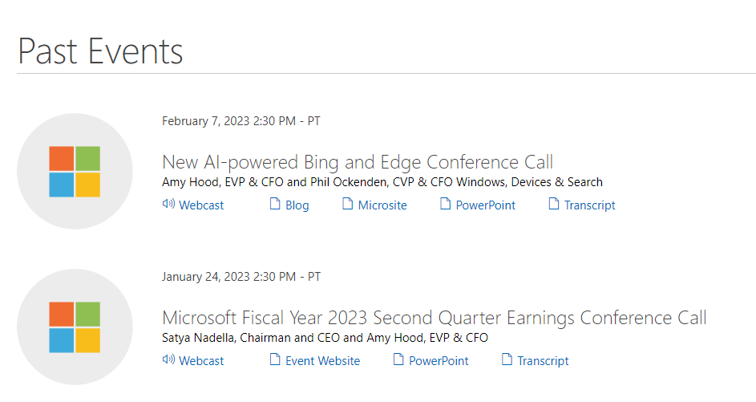

## WEB SCRAPING - STATIC LINKS

We will be going over how to use [rvest](https://github.com/tidyverse/rvest) to scrape links from [static websites](https://en.wikipedia.org/wiki/Static_web_page). Refer to the [static_pages/scraping_tables](./scraping_tables) readme for details of each functions.

### Loading Libraries
- tidyverse: data science
- rvest: web scraping

```
library(tidyverse)
library(rvest)
```

### Website
We will be scraping a list of articles from [MSFT's investor releations](https://www.microsoft.com/en-us/investor/events/events-recent.aspx).  
We will save this link as the variable: `url`

```
url <- "https://www.microsoft.com/en-us/investor/events/events-recent.aspx"
```

The articles we will be scraping looks like this:  


### Reading HTML
- Used the `read_html()` function to read the page's html.
- The data we want is wrapped in a parent div with the following css selector: `div.PastEvents div.m-content-placement-item.f-size-small`.
 - Used the `html_nodes()` function to pull it and all of it's children elements
- Saved this element as `div_tags`.

```
div_tags <- read_html(url) %>%
  html_nodes("div.PastEvents div.m-content-placement-item.f-size-small") 
```

### Scraping the articles
The following code block is a bit to unpack, so we'll do it step-by-step. Essentially, I created an `lapply()` loop that goes through each article div and pulls for it's title, date, and link. What's unique about this scrape is that not every article has a link, so we can't just retrieve by an anchor tag because it'll result in an uneven number of rows once we try to join all of these pieces to a final table.

```
msft_tbl <- lapply(1:length(div_tags), function(x){
  el <- div_tags[[x]] 
  
  title <- el %>%
    html_nodes("ul li:nth-child(3) h3") %>%
    html_text()
  
  date <- el %>%
    html_nodes("ul li:nth-child(2)") %>%
    html_text() %>%
    as.Date(., format = "%B %d, %Y")
  
  if(length(html_nodes(el, "ul li:nth-child(1) a")) > 0){
    link <- html_nodes(el, "ul li:nth-child(1) a") %>%
      html_attr("href") 
    
  } else {
    link <- NA
  }
  
  tbl <- data.frame(
    date = date,
    title = title,
    link = link)
  
  return(tbl)
})
```

### Scraping the articles cont.
The way `lapply()` works is that it applies the function from the 2nd argument to our 1st argument's values. We used the `length()` argument to see how many articles were within our div_tag (76) and then created a numeric vector from 1 to 76 `1:length(div_tags)`. Each iteration of this vector is passed through our function as the variable `x`.  

The first part of the lapply function is within the code block below:
- Subset the articles with `[[x]]` and saved it as the variable `el`.
- Used the `html_nodes()` function to select the 3rd li child element and extracted it's child h3 text. This is where our titles are located.
- Saved the title as `title`.

```
el <- div_tags[[x]] 

title <- el %>%
  html_nodes("ul li:nth-child(3) h3") %>%
  html_text()
```

### Scraping the articles cont.
The second part of the lapply function is within the code block below:
- Used the `html_nodes()` function to select the 2nd li child element and extracted it's text. This is where our dates are located.
- Used the `as.Date()` function and inputted the date's appropiate format with the `format` argument. This transforms the string to a date class.
- Saved the date as `date`.

```
date <- el %>%
  html_nodes("ul li:nth-child(2)") %>%
  html_text() %>%
  as.Date(., format = "%B %d, %Y")
```

### Scraping the articles cont.
As mentioned a [few sections ago](#scraping-the-articles), not every article has a link.
- Used an `if else` statement to see if an anchor tag exists in the current article.
 - If so, then pull it's `href` attribute and save as `link`.
 - Else, save NA as `link`.

```
if(length(html_nodes(el, "ul li:nth-child(1) a")) > 0){
  link <- html_nodes(el, "ul li:nth-child(1) a") %>%
    html_attr("href") 

} else {
  link <- NA
}
```

### Scraping the articles cont.
Finally, created a dataframe with the columns `date`, `title`, and `link` and save as `tbl`. 

```
tbl <- data.frame(
  date = date,
  title = title,
  link = link)
```

### End of the lapply function
Once the lapply function goes through all the articles, it will save each article as a dataframe in a list called `msft_tbl`.  

Sample of one of the articles:
|date                       |title                                              |link                                                         |
|---------------------------|---------------------------------------------------|-------------------------------------------------------------|
|2023-02-07                 |New AI-powered Bing and Edge Conference Call       |/en-us/Investor/events/FY-2023/AI-Powered-Bing-Edge-Conf.aspx|

### Cleaning the table
As we can see from the table above, the link column only has the path of the url, not the full link. This will be common in any anchor tag that redirects you to a different page in it's application. To create the full link, we just need to concatenate the domain url (`https://microsoft.com`) with the link column.
- Used the `bind_rows()` function to bind all articles from the msft_tbl list to a single dataframe.
- Used the `ifelse()` function to see if a link url starts with `/`, we will concatenate the domain url to it's beginning. Otherwise, leave it as is.
- Arranged by date in descending order.

```
msft_tbl <- bind_rows(msft_tbl) %>%
  mutate(link = ifelse(str_starts(link, "/"), paste("https://microsoft.com", link, sep = ""), link)) %>%
  arrange(desc(date))
```

### Final msft_tbl output
- date: date that the article was published
- title: title of the article
- link: link of the article

|date                       |title                                              |link                                                         |
|---------------------------|---------------------------------------------------|-------------------------------------------------------------|
|2023-02-07                 |New AI-powered Bing and Edge Conference Call       |https://microsoft.com/en-us/Investor/events/FY-2023/AI-Powered-Bing-Edge-Conf.aspx|
|2023-01-24                 |Microsoft Fiscal Year 2023 Second Quarter Earnings Conference Call|https://microsoft.com/en-us/Investor/events/FY-2023/earnings-fy-2023-q2.aspx|
|2022-12-19                 |IR Fireside Chat: Advertising                      |https://microsoft.com/en-us/Investor/events/FY-2023/IR-Fireside-Chat-Advertising|
|2022-12-13                 |Microsoft Annual Shareholders Meeting              |https://microsoft.com/en-us/Investor/events/FY-2023/Annual-Shareholders-Meeting-2022|
|2022-12-07                 |Barclays Global TMT Conference                     |https://microsoft.com/en-us/Investor/events/FY-2023/Barclays-Global-TMT-Conference|
