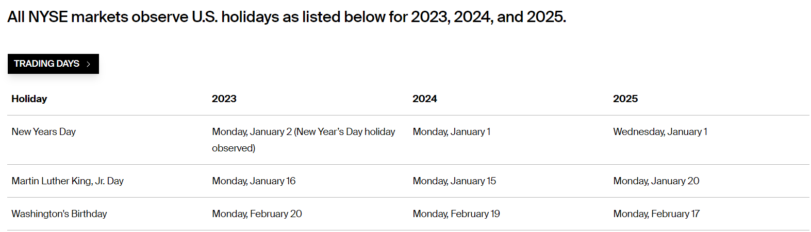

## WEB SCRAPING - STATIC TABLES

We will be going over how to use [rvest](https://github.com/tidyverse/rvest) to scrape tables from [static websites](https://en.wikipedia.org/wiki/Static_web_page). 

### Loading Libraries
- tidyverse: data science
- rvest: web scraping

```
library(tidyverse)
library(rvest)
```

### Website
We will be scraping a table from [NYSE](https://www.nyse.com/markets/hours-calendars) to collect market holidays for the upcoming years.  
We will save this link as the variable: `url`

```
url <- "https://www.nyse.com/markets/hours-calendars"
```

The table we will be scraping looks like this:  


### Reading the page source and selecting our targetted table
- We insert our url into the `read_html()` function to read the html from the page source. Since it's a static website, the entire dom is loaded once a client connects to the server. 
- Since the table we want is a `table` element, we can use the `html_table()` function to scrape all table elements on the page.
- html_table() returns a list of all tables on the page. The one we want is the first table, so we can use the `pluck()` function to pull it from the list to a dataframe called `raw_tbl`.

```
raw_tbl <- read_html(url) %>%
  html_table() %>%
  pluck(1)
```

### Alternative method
Instead of going through the list to select the table you want, you can use [css selectors](https://developer.mozilla.org/en-US/docs/Web/CSS/CSS_Selectors) to select where the desired table is placed in the html. In this case, our target table has a unique class value called `table-data`. We can use the css selector `table.table-data` to retrieve it and use the pluck function to pull it from the list.

```
raw_tbl <- read_html("https://www.nyse.com/markets/hours-calendars") %>%
   html_nodes("table.table-data") %>%
   html_table() %>%
   pluck(1)
```

### Sample of the raw_tbl's output

|Holiday                    |2023                                               |2024               |2025                |
|---------------------------|---------------------------------------------------|-------------------|--------------------|
|New Years Day              |Monday, January 2 (New Year’s Day holiday observed)|Monday, January 1  |Wednesday, January 1|
|Martin Luther King, Jr. Day|Monday, January 16                                 |Monday, January 15 |Monday, January 20  |
|Washington's Birthday      |Monday, February 20                                |Monday, February 19|Monday, February 17 |
|Good Friday                |Friday, April 7                                    |Friday, March 29   |Friday, April 18    |
|Memorial Day               |Monday, May 29                                     |Monday, May 27     |Monday, May 26      |

### Cleaning the table
I want the table to be in a long format and transform the dates to a date class (currently a string). This is going to be a unique case because the year is not part of the date values and some values has non-date characters in them. ie. the first row shows a parenthesis after the date with some useless information and later rows has differing amounts of astericks after the date. We need to remove all of the non-date components, format it to a consistent date-format, and then transform the string to a date class.

### Preparation
First thing's first, I created a string called `month_str` that has all of the month's in the appropiate format for later regex functions.   
ie. the format has to look like this: `January|February|March|etc..`
- Used the `month.name[x]` R constant to list all of the month's full name as a vector.
- Used the `paste()` function to collapse the month's names with a `|` in-between each value.

```
month_str <- paste(month.name[1:12], collapse = "|")
```

### Formatting the date value
- Used the `select()` function to select the 2-4th' columns (ie. all date columns).
- Mutated across all columns to concatenate a string that pulls the month's name and parsed the day's value into this format: `January, 2`.
- Used the `pivot_longer()` function to transform the data to a long format. This will make it easier for me to analyze the data later and concatenate the year with our `month_day` values.
- Concatenated the `month_day` and `year` columns into a column called `date` which looks like this: `January 1, 2023`.
- Used the `as.Date()` function to transform the `date` column to a date class.
 - Had to use the `format` argument to specify how the month/day/year is formatted. Learn more about date formats in R [here](https://www.stat.berkeley.edu/~s133/dates.html).
- Used the `arrange()` function to arrange our date column in ascending order.

```
date_tbl <- raw_tbl %>%
  select(2:4) %>%
  mutate(across(everything(), function(x) paste(str_extract(x, month_str), parse_number(x), sep = ", "))) %>%
  pivot_longer(everything(), names_to = "year", values_to = "month_day") %>%
  mutate(date = paste(month_day, year),
         date = as.Date(date, format = "%B, %d %Y")) %>%
  arrange(date)
```

### Sample of the date_tbl's output

|year                       |month_day                                          |date               |
|---------------------------|---------------------------------------------------|-------------------|
|2023                       |January, 2                                         |2023-01-02         |
|2023                       |January, 16                                        |2023-01-16         |
|2023                       |February, 20                                       |2023-02-20         |
|2023                       |April, 7                                           |2023-04-07         |
|2023                       |May, 29                                            |2023-05-29         |

### Joining date_tbl with the Holiday's name
- To join the holiday names with it's corresponding date, I tweaked some of the steps from the [date_tbl section](#formatting-the-date-value) to include the holiday's name with the year and month_day columns
- Used the `left_join()` function to join this new table with the date_tbl by the columns year and month_day
- Subsetted and renamed the columns to be consistent & arranged by date to create our final table: `holiday_tbl`

```
holiday_tbl <- raw_tbl %>%
  mutate(across(2:4, function(x) paste(str_extract(x, month_str), parse_number(x), sep = ", "))) %>%
  pivot_longer(2:4, names_to = "year", values_to = "month_day") %>%
  left_join(date_tbl, by = c("year", "month_day")) %>%
  select("holiday" = Holiday, date) %>%
  arrange(date)
```

### Sample of the holiday_tbl's output
- holiday: holiday's name
- date: holiday's date

|holiday                    |date                                               |
|---------------------------|---------------------------------------------------|
|New Years Day              |2023-01-02                                         |
|Martin Luther King, Jr. Day|2023-01-16                                         |
|Washington's Birthday      |2023-02-20                                         |
|Good Friday                |2023-04-07                                         |
|Memorial Day               |2023-05-29                                         |
